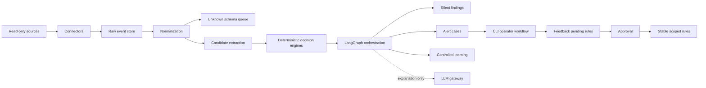

# Watchtower

**CLI-first UEBA platform for closed-network enterprise environments.**

Watchtower watches internal user and entity behavior, learns baselines, scores
candidate anomalies with deterministic engines, and opens explainable alerts or
silent findings depending on the operating mode.

It is designed for private LAN deployments where logs may come from file
servers, identity systems, Elasticsearch/Wazuh, application audit trails, or the
included `server-stack/` closed-lab replay environment.

```text
connectors -> raw events -> normalization -> candidate events
           -> policy / baseline / feedback / correlation / severity
           -> LangGraph mode routing
           -> silent finding | alert case | controlled learning update
```

## What It Does

- Ingests read-only security and business telemetry from multiple sources.
- Normalizes raw records into a unified event schema.
- Extracts candidate behavior events tied to the 81-feature Watchtower taxonomy.
- Learns user, department, role, asset, and time-window baselines.
- Applies deterministic policy, baseline, feedback, correlation, and severity engines.
- Routes outcomes through `learn`, `run`, and `hybrid` modes.
- Creates alert cases, silent findings, feedback rules, audit records, and reports.
- Uses LLM providers only for explanation and drafting tasks, never final decisions.

## Non-Negotiables

Watchtower is intentionally conservative:

- LLMs do not decide whether something is an alert.
- LangGraph orchestrates the flow; it does not own the scoring math.
- Manager feedback never becomes a stable rule directly.
- Feedback follows `pending_rule -> approve -> stable`.
- `policy-rule` behavior is not silently normalized.
- Connectors are read-only; Watchtower observes, explains, and alerts.
- No auto-remediation, blocking, process killing, host quarantine, or user lockout.

## Operating Modes

| Mode | Alerting | Learning | Use case |
|------|----------|----------|----------|
| `learn` | No external alerts | Yes | Baseline the company quietly |
| `run` | Yes | No | Production monitoring on approved rules and baselines |
| `hybrid` | Yes | Controlled | Monitor while tracking approved drift |

## Core Capabilities

| Area | Status |
|------|--------|
| Feature taxonomy | 81/81 features classified and validated |
| Server-stack scenarios | 83/83 scenarios covered |
| Connectors | server-stack, JSONL file, Elasticsearch, Wazuh-compatible |
| Storage | SQLite migrations, repositories, audit records |
| Baseline | 45-day default learning window, confidence, snapshots |
| Feedback | pending rule, approval, scoped stable rule, expiry |
| Decision | deterministic policy/baseline/feedback/correlation/severity |
| Graph | LangGraph mode routing, audit, interrupt/resume |
| LLM | OpenAI, Anthropic, Gemini, Ollama, custom OpenAI-compatible |
| CLI | bootstrap, modes, ingest, alerts, rules, query, health, backup |
| Production | Docker, backup/restore, retention, migrations, health checks |

## Architecture



## Repository Layout

```text
watchtower-demo/
  watchtower/                 product package
  tests/                      unit, integration, graph, LLM, E2E, production tests
  docs/                       install and operations docs
  scripts/                    install, upgrade, soak, taxonomy tooling
  reports/watchtower/         product evidence reports
  server-stack/               closed-network lab used as test target
```

`server-stack/` is not product code. It is the replay and evidence lab used to
prove Watchtower behavior against 81 features and 83 scenarios.

## Quick Start

### Bare Metal

```bash
python3 -m venv .venv
source .venv/bin/activate
pip install -e ".[dev]"

cp .env.example .env
./scripts/fresh_install.sh

wt status
wt health
```

### Docker

```bash
cp .env.example .env
docker compose config
docker compose build
docker compose run --rm watchtower wt bootstrap -u admin -e admin@corp.local
docker compose up -d
docker compose exec watchtower wt health --json
```

## Basic CLI

```bash
wt bootstrap -u admin -e admin@corp.local
wt status

wt modes get
wt modes set learn
wt modes set run
wt modes set hybrid

wt sources register -t file_jsonl -n "AD JSONL" -c '{"file_path":"/data/ad.jsonl"}'
wt sources list
wt sources health
wt ingest once --source <source-id>

wt alerts list
wt alerts show <alert-id>
wt alerts ack <alert-id>
wt alerts close <alert-id> --outcome true_positive
wt alerts suppress <alert-id> --duration 7d

wt findings silent --last 7d
wt rules pending
wt rules approve <pending-rule-id>
wt rules reject <pending-rule-id> --comment "too broad"

wt query "critical backend alerts in the last 24 hours"
```

## LLM Providers

LLM providers are optional. Watchtower keeps working if every provider is down.

Supported adapters:

- OpenAI
- Anthropic
- Gemini
- Ollama / OpenAI-compatible local endpoint
- Custom OpenAI-compatible endpoint

Configure provider order with:

```bash
wt providers list
wt providers set-chain gemini,ollama
wt providers clear-chain
```

Provider secrets live in `.env` and must never be committed. LLM output is
schema-validated and limited to explanation, mapping, summary, and draft tasks.

## Tests And Evidence

Run the full product suite:

```bash
pytest tests/ -q
```

Run production gates:

```bash
pytest tests/production tests/load -v
docker compose config
./scripts/fresh_install.sh
./scripts/upgrade.sh
```

Run closed-lab validation:

```bash
cd server-stack
make test-all
make test-real-all
```

Current acceptance evidence:

| Gate | Evidence |
|------|----------|
| Product test suite | `454 passed` |
| Feature taxonomy | `81/81` |
| Server-stack scenarios | `83/83` |
| E2E summary | `reports/watchtower/e2e_summary.json` |
| Production readiness | `reports/watchtower/production_readiness.json` |
| Final acceptance | `reports/watchtower/final_acceptance_report.md` |

## Operations

Health:

```bash
wt health
wt health --json
```

Migrations:

```bash
wt migrate status
wt migrate upgrade
```

Backup and restore:

```bash
wt backup create
wt backup list
wt backup restore /backups/watchtower-YYYYMMDDTHHMMSS.db --yes
```

Retention:

```bash
wt retention apply --dry-run
wt retention apply
```

Soak:

```bash
./scripts/soak_short.sh
SOAK_HOURS=24 ./scripts/soak_24h.sh
```

## Production Notes

- Run `learn` mode first to build confidence before operational alerting.
- Review generated taxonomy classifications before a real company cutover.
- Keep `.env` outside git; `.env.example` is the only committed template.
- Configure at least one LLM provider for explanations, or rely on fail-open notes.
- Run the documented 24-hour soak before the first closed-network deployment.
- Current graph checkpointing uses in-process `MemorySaver`; durable checkpointing
  should be added before relying on long in-flight human approval workflows.

## Documentation

- [Install guide](docs/install.md)
- [Operations guide](docs/operations.md)
- [Production readiness report](docs/production-readiness-report.md)
- [Final acceptance report](reports/watchtower/final_acceptance_report.md)
