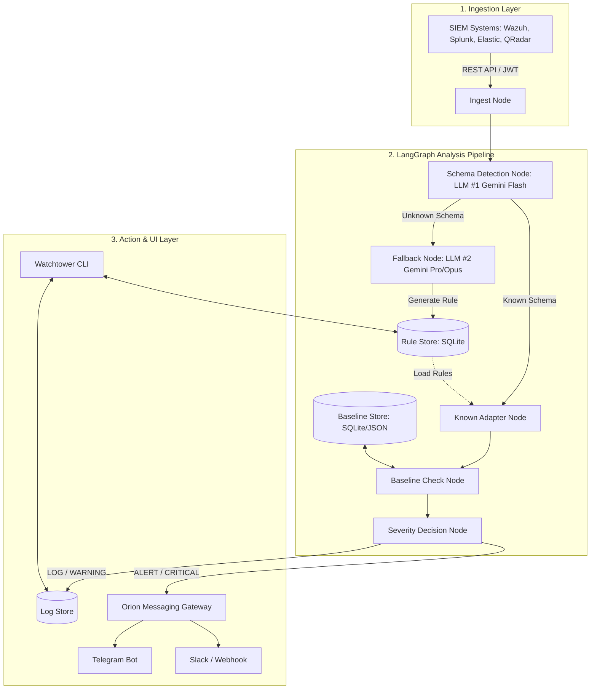

# Watchtower (Vigil) — Integration Planning & Architecture

This document presents the architectural analysis and integration planning for **Watchtower (Vigil)**, an LLM-powered User and Entity Behavior Analytics (UEBA) system. Watchtower is designed to operate 24/7 on corporate intranets (private LANs), ingesting events from SIEM systems, building behavioral baselines, detecting anomalies, and alerting administrators.

---

## 1. Analysis of Existing Projects & Reusable Assets

To minimize development time and leverage proven patterns, we will reuse core structural elements from your existing workspace projects:

| Project | Core Domain | Key Assets & Patterns to Reuse |
| :--- | :--- | :--- |
| **Sentinel** | Infra Observability | <ul><li>**Monorepo Integration:** Housing Watchtower as a subproject within the `sentinel-coming` repo.</li><li>**Observability Gateway:** Querying telemetry (such as security log feeds) through read-only endpoint adapters.</li><li>**CLI Design:** CLI prompt routing structure and configuration system.</li></ul> |
| **ARCHON** | LangGraph Orchestration | <ul><li>**LangGraph Engine:** State management, checkpointing, and conditional node routing.</li><li>**SQLite Storage:** `aiosqlite` repository pattern and checkpoint store.</li><li>**Human-in-the-Loop Gate:** The approval state machine (`pending`, `approved`, `rejected`) for autonomous rules and alerts.</li></ul> |
| **OrionCli** | Messaging & Tool Agent | <ul><li>**Messaging Gateway:** Multi-platform adapters (Telegram, Slack, Email, Discord, Webhooks) for alert routing.</li><li>**Context Management:** Context compression algorithms and session history databases.</li></ul> |
| **EstatePilot** | Web Assistant Prototype | <ul><li>**Proactive Engine:** Periodic check logic (e.g., 30s ticks for lead/incident aging, drift detection).</li><li>**3-Panel UI Design:** Potential web UI dashboard layout (Alerts | Trace | Insights & Details).</li></ul> |
| **Argus** | Agent Runtime | <ul><li>**Permission Levels:** Configurable control constraints (`locked`, `yolo`, `planning`).</li><li>**Trajectory Recording:** Audit trails of LLM decisions and generated regex rules.</li><li>**Hooks System:** Pre-run and post-run filters for customized detection overrides.</li></ul> |

---

## 2. Proposed Architecture

### A. The LangGraph Pipeline Stages
1. **Ingest Node:** Periodically fetches raw log batches from SIEM APIs.
2. **Schema Detection Node (LLM #1 - Gemini Flash):** Automatically classifies the log format (e.g., "Wazuh alert", "Windows AD Event").
3. **Known Adapter Node:** Normalizes known structures into a unified event schema (User, Action, Source, Destination, Quantity, Timestamp).
4. **Fallback Node (LLM #2 - Gemini Pro/Opus):** Triggered when an unknown log format is encountered. It generates schema-mapping rules and saves them to the **Rule Store** under `pending` status.
5. **Baseline Check Node:** Compares normalized event dimensions (e.g., volume of data pulled, access times) against the target user/department profile in the **Baseline Store**.
6. **Severity Decision Node:** Determines the threat level:
   - `LOG` (normal)
   - `WARNING` (slight anomaly, record only)
   - `ALERT` (anomaly detected, notify manager)
   - `CRITICAL` (extreme deviation, immediate notification + automated response proposal)

---

## 3. Databases & Stores (SQLite)
- **Rule Store:** Persistent database storing regex, parsing rules, and auto-generated mappings.
  - *Schema:* `id`, `signature`, `field_mapping` (JSON), `status` (`pending`, `stable`, `deleted`), `used_count`, `created_at`.
- **Baseline Store:** Multi-dimensional profile tracking:
  - *User Profile:* Daily bandwidth mean/variance, hourly access distribution, accessed servers list.
  - *Department Context:* Role-based average thresholds to avoid false positives for IT admin or backup teams.

---

## 4. Phase-based Integration Plan

### Phase 1: Foundation & Monorepo Setup
- Create a new package `sentinel-coming/watchtower` inside the main Sentinel monorepo.
- Initialize the Python virtual environment and dependencies (`langgraph`, `aiosqlite`, `google-genai`).
- Establish the SQLite schemas for `Rule Store` and `Baseline Store` (reusing the SQLite repository pattern from ARCHON).

### Phase 2: Ingestion & LLM Classifiers
- Implement SIEM adapters (starting with Wazuh API connector, followed by Splunk and Elastic).
- Build the LangGraph workflow structure.
- Construct prompts for **LLM #1 (Schema classification)** and **LLM #2 (Rule generation & mapping fallback)**.

### Phase 3: Baseline & Learning Engine (Faz 1)
- Write the baseline generation logic.
- Implement the "Learning Phase" daemon:
  - Runs in the background (silent mode) for a configured period (1-2 months).
  - Aggregates daily statistics, updates average data consumption, and populates the Baseline Store.
  - Prevents alert dispatching during this period.

### Phase 4: Active Threat Detection (Faz 2)
- Implement severity calculation logic combining deviation scale, time context (working vs. non-working hours), server sensitivity, and department context.
- Implement human-in-the-loop validation for generated rules (reusing ARCHON's approval gates).

### Phase 5: Notification Gateway & CLI
- Integrate OrionCli's messaging adapters to support Slack, Telegram, and email notifications.
- Build the CLI query console (e.g., `watchtower status`, `watchtower query "warnings last 24h"`).
- (Optional) Build an EstatePilot-inspired Vite/React local dashboard to view logs and approve pending parser rules.

---

## 5. Key Integration Questions & Missing Details

> [!IMPORTANT]
> To refine the design and prepare the code, please provide feedback on the following questions:

1. **Log Data Source Routing:** Do you want Watchtower to query the SIEM systems (Wazuh, Splunk, Elastic) directly via their REST APIs, or should it pull logs from the existing Sentinel stack (e.g., querying Loki via the `observability-gateway`)?
2. **Alert Destination Channels:** Which communication platforms should we prioritize for manager notifications (e.g., Telegram, Slack, Microsoft Teams, Email)?
3. **UI / Dashboard preference:** Is a CLI + direct messaging notifications sufficient for release, or do you want a web-based dashboard (similar to EstatePilot) to visually manage baseline parameters and rule approvals?
4. **Target SIEM for Phase 2:** Which SIEM platform (Wazuh, Splunk, Elastic, or flat Windows Event Logs) do you want us to write the first ingestion adapter for?
5. **Workspace Directory Structure:** Confirm if we should create `sentinel-coming/watchtower` as the subproject directory, or keep it completely independent of the Sentinel folder structure in the workspace.
