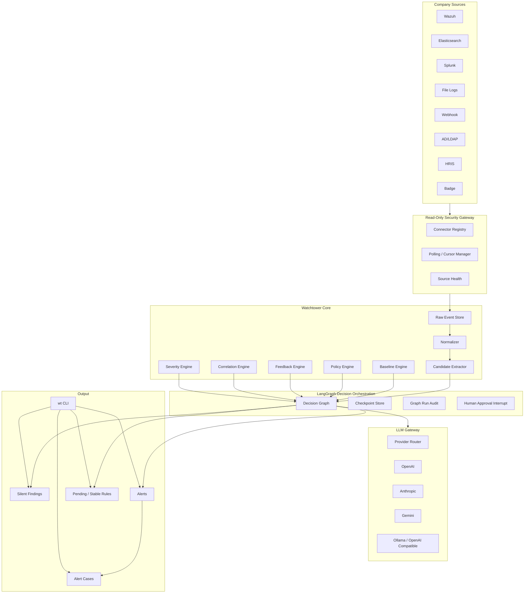

# Watchtower — Production Architecture & Implementation Plan

> **Ürün:** LLM destekli, şirket içi kullanıcı davranışı izleme CLI/daemon sistemi  
> **Kategori:** UEBA — User and Entity Behavior Analytics  
> **Hedef:** Prototip değil; gerçek şirket kapalı ağlarında kurulabilir, test edilmiş, provider bağımsız ürün  
> **Test lab:** `server-stack/` içindeki 81 feature ve 83 scenario kapalı sunucu ortamı  
> **Son revizyon:** 23 Mayıs 2026

---

## 0. Klasör Ayrımı

- **`watchtower-demo/`** = Ürünün kendisi. Watchtower CLI, daemon, connector, baseline, decision, alert ve LLM gateway kodu burada inşa edilir.
- **`watchtower-demo/server-stack/`** = Ürünü test etmek için kurulan kapalı şirket ağı. Watchtower bunu izler; ürün kodu buraya gömülmez.

Kural:

```text
server-stack olay üretir
watchtower ürünü bu olayları izler, öğrenir, değerlendirir ve uyarı üretir
```

---

## 1. Ürün İlkeleri

### 1.1 Watchtower Ne Yapar?

Watchtower, şirket iç ağındaki kullanıcı ve entity davranışlarını izler:

- dosya erişimi
- veri çekimi
- SQL sorguları
- login/oturum davranışları
- AD/LDAP grup değişiklikleri
- mail, git, web, AI, cloud, HR, badge, print, endpoint aktiviteleri
- cross-signal korelasyonlar

Watchtower müdahale etmez, engellemez, sistemleri değiştirmez. Sadece izler, öğrenir, alert/case üretir ve açıklama sağlar.

### 1.2 LLM Karar Vermez

LLM hiçbir zaman final anomali/alert kararını vermez.

LLM'in izinli görevleri:

- alert açıklaması yazmak
- bilinmeyen schema için mapping önerisi üretmek
- manager/operator feedback'inden `pending_rule` taslağı üretmek
- öğrenme dönemi özetleri ve baseline raporları hazırlamak
- CLI doğal dil sorgularına, mevcut store verisine dayanarak cevap üretmek

Final kararları şu deterministic katmanlar verir:

- `policy_engine`
- `baseline_engine`
- `feedback_engine`
- `correlation_engine`
- `severity_engine`

### 1.3 Her Eşik Aşımında LLM Çağrılmaz

LLM sadece gerekli olduğunda çağrılır:

- açıklama gerekiyorsa
- unknown schema varsa
- pending rule önerisi gerekiyorsa
- periyodik learning summary gerekiyorsa
- operator doğal dil sorgusu varsa

Tekrarlayan benign pattern, approved scoped feedback-rule ile LLM'e gitmeden downrank/suppress edilir.

---

## 2. Çalışma Modları

### 2.1 `learn` Modu

Amaç: Şirketi öğrenmek.

Davranış:

- Dış alert yok.
- Bildirim yok.
- Hard-rule dahil hiçbir şey kullanıcıya gönderilmez.
- `silent_candidate_finding` oluşur.
- Baseline, profile, candidate pattern ve rule suggestion için veri toplanır.
- 45 gün default learning window kullanılır.
- Süre configurable olmalıdır.

Kapatma kriterleri:

- minimum gün sayısı tamamlandı
- kullanıcı başına yeterli aktif gün var
- departman/rol örneklem sayısı yeterli
- baseline confidence hesaplandı
- manager/system_admin onayı alındı

### 2.2 `run` Modu

Amaç: Öğrenme kapalı şekilde operasyonel izleme.

Davranış:

- Proaktif öğrenme yok.
- Baseline otomatik değişmez.
- Sadece stable policy, approved baseline ve approved feedback-rule kullanılır.
- Manager/operator feedback'i doğrudan sistemi değiştirmez.
- Feedback sonrası LLM veya deterministic builder `pending_rule` üretir.
- `pending_rule` ancak security_operator veya system_admin onayıyla stable olur.

### 2.3 `hybrid` Modu

Amaç: İzleme ve kontrollü öğrenmeyi birlikte yürütmek.

Davranış:

- Alert üretir.
- Baseline drift'i takip eder.
- Feedback ve proje bağlamından scoped pending rule üretebilir.
- Kritik/policy davranışı otomatik normalleştirmez.
- Rolling window ve approval gate ile öğrenir.

---

## 3. Detection Taxonomy

Her feature tam olarak bir primary detection sınıfına sahip olmalıdır. Gerekirse secondary sınıflar eklenebilir.

| Sınıf | Tanım | Baseline gerekir mi? | Feedback ile otomatik normalleşir mi? |
|-------|------|----------------------|---------------------------------------|
| `policy-rule` | Rol/yetki/iş akışı açısından yasak veya bypass davranışı | Hayır | Hayır, explicit approved exception gerekir |
| `hard-rule` | Baseline olmadan da riskli teknik veya güvenlik ihlali | Hayır | Hayır, sadece scoped exception |
| `baseline-anomaly` | Kullanıcının veya departmanın normalinden sapma | Evet | Evet, approval sonrası scoped rule ile |
| `cross-signal` | Birden fazla kaynaktan gelen sinyallerin birleşimi | Kısmen | Genellikle hayır; korelasyon kapsamına göre approval gerekir |

### 3.1 `policy-rule` Kesin Tanımı

`policy-rule`, davranış daha önce sık görülse bile normal kabul edilmeyen iş/yetki ihlalidir.

Örnekler:

- frontend rolünün backend API yerine direkt SQL DB'ye erişmesi
- worker rolünün privileged admin action çalıştırması
- service account ile interactive login
- ticket olmadan production permission escalation
- HR dışı rolün HR DB export yapması

Policy-rule davranışı ancak şu durumda düşürülebilir:

- açık scoped exception var
- exception bir approver tarafından onaylanmış
- exception süre, kullanıcı/rol, resource ve action kapsamı taşıyor
- audit trail var

### 3.2 Feature Sınıflandırma Sahipliği

Bu plan özellikle geri bildirimde işaretlenen belirsizliği kapatır:

- 81 feature sınıflandırmasını **Faz 0 görevi olarak kod yazacak AI tamamlayacak**.
- AI, `watchtower-features-final.md`, `server-stack/simulation/feature_catalog/features.yml` ve `server-stack/reports/real/coverage/real_final_gate.json` dosyalarını okuyacak.
- Faz 0 başlamadan önce bu üç referans dosyasının varlığı preflight test ile doğrulanacak; dosya eksikse taxonomy yazılmayacak, önce server-stack artifact üretimi veya yol düzeltmesi yapılacak.
- Çıktı dosyası ürün tarafında olacak: `watchtower/config/feature_taxonomy.yml`.
- Her feature için alanlar zorunlu olacak:
  - `feature_id`
  - `primary_detection_class`
  - `secondary_detection_classes`
  - `default_severity_floor`
  - `requires_baseline`
  - `can_be_feedback_learned`
  - `requires_approval_for_suppression`
  - `required_context`
  - `server_stack_replay_refs`

Faz 0 kapanış kapısı:

```text
81/81 feature taxonomy complete
0 unknown primary class
policy-rule list explicit
all taxonomy entries validated by tests
```

---

## 4. Karar Mantığı

Watchtower tek event'e bakarak karar vermez. Her candidate event şu bağlamlarla değerlendirilir:

- kullanıcı
- rol
- departman
- manager ilişkisi
- asset/resource
- action tipi
- zaman
- hacim/hız
- kişisel baseline
- departman baseline
- rol-in-department baseline
- asset kritiklik seviyesi
- geçmiş alertler
- manager/operator feedback'i
- approved scoped feedback-rule
- ticket/project/maintenance context
- cross-signal korelasyonlar

Karar sırası:

```text
1. policy-rule veya hard-rule var mı?
2. approved scoped exception var mı?
3. change ticket / project context var mı?
4. user baseline sapması var mı?
5. department ve role baseline sapması var mı?
6. cross-signal correlation var mı?
7. feedback-rule severity modifier uyguluyor mu?
8. severity üret: LOG / WARNING / ALERT / CRITICAL
9. mode'a göre route et
10. gerekirse LLM açıklaması veya pending rule üret
```

### 4.1 Threshold Model

Eşikler tek global sayı değildir.

Katmanlar:

- global default threshold
- department threshold
- role-in-department threshold
- user-specific threshold
- asset-specific threshold
- time-window threshold
- feedback-adjusted scoped threshold

Default değerler sistem kurulumu için sağlanır, fakat öğrenme sonunda profile göre değişir.

Örnek:

```text
Mehmet normalde 1000-2000 SQL query atıyorsa 1000 query normal olabilir.
Yiğit normalde 10-20 query atıyorsa 100 query alert olabilir.
```

---

## 5. Sistem Mimarisi



---

## 6. LangGraph Rolü

LangGraph karar matematiğini yapmaz. LangGraph şunları yapar:

- node orchestration
- branch routing
- checkpoint/recovery
- state audit
- human-in-the-loop approval
- mode-specific flow
- LLM çağrılarının koşullu çalıştırılması

Karar matematiği bağımsız Python servislerinde kalır:

- `policy_engine`
- `baseline_engine`
- `feedback_engine`
- `correlation_engine`
- `severity_engine`

### 6.1 Decision Graph Node Sözleşmesi

Graph'a raw log değil, `candidate_event` girer.

Node listesi:

1. `load_mode`
2. `resolve_identity`
3. `resolve_asset`
4. `load_feature_taxonomy`
5. `load_policy_context`
6. `load_baseline_context`
7. `load_feedback_context`
8. `load_change_context`
9. `score_candidate`
10. `decide_severity`
11. `route_by_mode`
12. `persist_silent_finding`
13. `create_alert_case`
14. `maybe_generate_llm_explanation`
15. `maybe_generate_pending_rule`
16. `await_rule_approval`
17. `finalize_decision`

### 6.2 Mode Routing

```text
learn:
  persist_silent_finding
  enqueue_baseline_update
  no alert
  no notification

run:
  no baseline update
  apply only approved rules
  create alert/case if severity requires
  feedback creates pending_rule only

hybrid:
  create alert/case if severity requires
  apply controlled learning update
  feedback creates pending_rule
  stable only after approval
```

---

## 7. LLM Gateway

Providerlar:

- `openai`
- `anthropic`
- `gemini`
- `ollama`
- `custom_openai_compatible`

Her provider capability registry ile tanımlanır:

- `structured_output`
- `tool_calling`
- `json_schema_strict`
- `streaming`
- `local`
- `max_context_tokens`
- `supports_responses_api`
- `supports_chat_completions`

LLM outputları schema validated olmak zorundadır.

LLM görev şemaları:

- `AlertExplanation`
- `RuleCandidateDraft`
- `UnknownSchemaMapping`
- `BaselineSummary`
- `MonthlyLearningReport`
- `OperatorQueryAnswer`

Failure policy:

- LLM yoksa sistem durmaz.
- Detection devam eder.
- Alert açıklaması yerine `LLM unavailable - manual review required` notu düşer.
- LLM failure audit edilir.

---

## 8. Veri Modeli

### 8.1 Core Tables

| Entity | Açıklama |
|--------|----------|
| `tenant` | Her şirket kurulumu için izolasyon kaydı |
| `source` | Wazuh/Elastic/Splunk/file/webhook bağlantısı |
| `source_cursor` | Polling cursor ve offset |
| `raw_event` | Ham log |
| `normalized_event` | Unified schema event |
| `candidate_event` | Karar graph'ına girecek event |
| `feature_taxonomy` | 81 feature sınıflandırması |
| `graph_run_audit` | LangGraph node geçişleri |

### 8.2 Baseline Tables

| Entity | Açıklama |
|--------|----------|
| `user_profile` | Kişisel davranış profili |
| `department_profile` | Departman normları |
| `role_profile` | Rol bazlı normlar |
| `asset_profile` | Asset erişim normları |
| `baseline_snapshot` | Günlük/haftalık/aylık snapshot |
| `learning_window` | 45 günlük learning progress |

### 8.3 Context Tables

| Entity | Açıklama |
|--------|----------|
| `identity_alias` | AD user, email, service account, API key eşleşmesi |
| `session_map` | Aktif oturum/IP/device ilişkisi |
| `asset` | Server, DB, share, app, endpoint envanteri |
| `change_ticket` | Bakım/proje/ticket bağlamı |
| `hr_event` | İşe giriş, çıkış, rol değişimi |
| `badge_event` | Fiziksel giriş/çıkış |

### 8.4 Feedback & Rule Tables

| Entity | Açıklama |
|--------|----------|
| `policy_rule` | Hard/policy rule tanımı |
| `feedback_event` | Manager/operator feedback kaydı |
| `pending_rule` | Onay bekleyen scoped rule |
| `feedback_rule` | Onaylı scoped rule |
| `rule_approval` | Approve/reject audit trail |

### 8.5 Alert Tables

| Entity | Açıklama |
|--------|----------|
| `silent_candidate_finding` | Learn mode ve analiz için sessiz bulgu |
| `alert` | Üretilen uyarı |
| `alert_case` | Operatör workflow state'i |
| `suppression_window` | Süreli bastırma |
| `llm_call_audit` | Prompt, provider, schema, token/cost audit |

---

## 9. Connector Mimarisi

Ürün en baştan gerçek şirket ortamına taşınabilir connector yapısıyla kurulacaktır.

İlk connectorlar:

- `server_stack_connector`
- `file_jsonl_connector`
- `elasticsearch_connector`
- `wazuh_connector`

Sonraki connectorlar:

- `splunk_connector`
- `ldap_connector`
- `hris_connector`
- `badge_connector`
- `webhook_connector`

Connector sözleşmesi:

```text
health() -> SourceHealth
poll(cursor, limit) -> EventBatch
ack(cursor) -> None
schema_hint() -> SourceSchemaHint
```

Kural:

- Connector read-only olmalıdır.
- Connector failure tüm sistemi düşürmemelidir.
- Cursor kaybı duplicate-safe olmalıdır.
- Her connector mocked ve integration test ister.

---

## 10. CLI

İlk MVP'de Telegram yoktur. CLI zorunlu arayüzdür.

Komutlar:

```bash
wt bootstrap
wt status
wt modes get
wt modes set learn|run|hybrid
wt sources list
wt sources health
wt ingest once --source <id>
wt alerts list
wt alerts show <id>
wt alerts ack <id>
wt alerts close <id> --outcome true_positive|false_positive
wt alerts suppress <id> --duration 7d
wt findings silent --last 7d
wt baseline user <user_id>
wt baseline department <department>
wt rules pending
wt rules approve <rule_id>
wt rules reject <rule_id>
wt query "son 24 saatte kritik backend anomalileri"
```

---

## 11. Uygulama Fazları

Her faz test kanıtı olmadan kapanmaz.

Teslim formatı:

```text
DEĞİŞEN DOSYALAR:
YAZILAN TESTLER:
ÇALIŞTIRILAN TESTLER:
SONUÇ:
KALAN RİSKLER:
```

### Faz 0 — Taxonomy & Architecture Freeze

Amaç: Kod başlamadan feature classification ve policy-rule belirsizliğini kapatmak.

Yapılacaklar:

1. Preflight referans kontrolü yaz: `watchtower-features-final.md`, `server-stack/simulation/feature_catalog/features.yml`, `server-stack/reports/real/coverage/real_final_gate.json`.
2. `watchtower/config/feature_taxonomy.yml` oluştur.
3. 81 feature için detection class belirle.
4. `policy-rule` listesi açık yazılsın.
5. `feature_taxonomy` schema validator yaz.
6. `server-stack` feature/scenario referansları bağlansın.

Testler:

- Preflight referans dosyaları mevcut.
- 81/81 taxonomy entry.
- Her entry primary class içerir.
- `policy-rule` entry'lerinde `requires_approval_for_suppression=true`.
- `baseline-anomaly` entry'lerinde baseline context tanımlıdır.
- Server-stack feature id'leriyle uyuşur.

Gate:

```bash
pytest tests/config/test_feature_taxonomy.py -v
```

### Faz 1 — Product Skeleton

Yapılacaklar:

1. `watchtower/` Python package.
2. Typer CLI skeleton.
3. Config loader.
4. SQLite migration sistemi.
5. Tenant/bootstrap admin.
6. Mode controller.
7. Audit logging.

Testler:

- Fresh DB migration.
- Tenant isolation.
- Bootstrap admin required.
- Mode switch.
- CLI smoke.

### Faz 2 — Connector & Ingest

Yapılacaklar:

1. Connector protocol.
2. `server_stack_connector`.
3. `file_jsonl_connector`.
4. `elasticsearch_connector`.
5. `wazuh_connector`.
6. Cursor/deduplication.
7. Raw event store.

Testler:

- Mock connector.
- Server-stack log ingestion.
- Elasticsearch health/query.
- Cursor duplicate safety.
- Source failure graceful degradation.

### Faz 3 — Normalization & Candidate Extraction

Yapılacaklar:

1. Unified event schema.
2. Known adapters.
3. Unknown schema queue.
4. LLM-free deterministic normalization.
5. Candidate extractor.

Testler:

- 81 feature fixture normalize olur.
- 83 scenario fixture normalize olur.
- Unknown schema pending mapping üretir.
- Raw event graph'a doğrudan girmez.

### Faz 4 — Baseline Engine

Yapılacaklar:

1. User/department/role/asset profile hesapları.
2. 45 gün default learning window.
3. Configurable learning duration.
4. Confidence score.
5. Daily/weekly/monthly snapshots.

Testler:

- 45 günlük replay baseline üretir.
- User-specific baseline department ortalamasına ezilmez.
- Manager/worker ayrımı role profile'a yansır.
- Baseline confidence düşükse run transition önerilmez.

### Faz 5 — Feedback & Rule Approval

Yapılacaklar:

1. Feedback event modeli.
2. Pending rule modeli.
3. Approval workflow.
4. Scoped feedback-rule.
5. Expiry ve audit trail.

Testler:

- Manager feedback stable rule yapmaz.
- Pending rule approve edilmeden uygulanmaz.
- Approved scoped rule aynı pattern'i downrank eder.
- Scope dışı event alert üretir.
- Policy-rule feedback ile otomatik suppress olmaz.

### Faz 6 — Decision Engines

Yapılacaklar:

1. `policy_engine`.
2. `baseline_engine` query API.
3. `feedback_engine`.
4. `correlation_engine`.
5. `severity_engine`.
6. Score breakdown modeli.

Testler:

- Frontend direct DB access policy critical.
- Normalleşmiş high-volume user tekrar alert üretmez.
- Aynı hacim manager/worker için farklı severity üretebilir.
- Kişisel baseline sapması manager için de alert üretir.
- Cross-signal severity yükseltir.

### Faz 7 — LangGraph Decision Orchestration

Yapılacaklar:

1. Decision graph.
2. Checkpoint store.
3. Node output schemas.
4. Mode routing.
5. Human approval interrupt.
6. Graph audit.

Testler:

- Learn mode: 0 alert, silent finding var.
- Run mode: learning update yok.
- Hybrid mode: alert + controlled learning.
- Crash recovery checkpoint.
- Pending rule approval sonrası graph devam eder.

### Faz 8 — LLM Gateway

Yapılacaklar:

1. Provider protocol.
2. OpenAI adapter.
3. Anthropic adapter.
4. Gemini adapter.
5. Ollama/OpenAI-compatible adapter.
6. Capability registry.
7. Structured output validation.
8. Token/cost audit.

Testler:

- Mock provider matrix.
- Invalid JSON retry.
- Provider fallback.
- LLM unavailable fail-open.
- LLM decision yapamaz; sadece schema output üretir.

### Faz 9 — Alert Lifecycle & CLI

Yapılacaklar:

1. Alert store.
2. Alert case lifecycle.
3. CLI commands.
4. Suppression window.
5. Natural language query over store.

Testler:

- `open -> investigating -> true_positive`.
- `false_positive` feedback pending rule üretir.
- Suppression expiry.
- CLI command integration.
- Query returns auditable store-backed answer.

### Faz 10 — Server-Stack End-to-End Validation

Yapılacaklar:

1. 81 feature replay ingest.
2. 83 scenario replay ingest.
3. Learn mode replay.
4. Run mode replay.
5. Hybrid mode replay.
6. Feedback replay.
7. LLM provider mock replay.
8. Ollama-compatible local path test.

Gate:

```text
81/81 features ingested and normalized
83/83 scenarios ingested and normalized
learn mode: 0 alert, silent findings present
run mode: expected alert cases
hybrid mode: expected alert + baseline update
feedback suppress/downrank works
policy-rule cannot be silently normalized
LLM unavailable path passes
```

### Faz 11 — Production Readiness

Yapılacaklar:

1. Docker compose / installer.
2. `.env.example`.
3. Source onboarding.
4. Provider onboarding.
5. Backup/restore.
6. DB migration upgrade path.
7. Retention policy.
8. Health checks.
9. Soak/load tests.
10. Security audit.

Gate:

- Fresh install pass.
- Upgrade migration pass.
- Backup restore pass.
- Provider switch pass.
- Source outage graceful.
- Multi-tenant leak test pass.
- 24h daemon soak pass.

---

## 12. Test Stratejisi

Test katmanları:

1. Unit tests
2. Contract tests
3. Fixture normalization tests
4. Decision table tests
5. LangGraph node tests
6. LLM mock provider tests
7. CLI integration tests
8. Server-stack E2E tests
9. Soak/load tests

Zorunlu test yüzeyleri:

- feature taxonomy
- policy-rule suppression guard
- baseline profile math
- feedback approval flow
- mode routing
- connector cursor/deduplication
- LLM unavailable
- provider capability fallback
- graph checkpoint recovery
- alert lifecycle

---

## 13. Skill Dosyaları

Ürün tarafında AI görevleri için skill'ler `watchtower-demo/skills/` altında tutulur.

Zorunlu skill seti:

- `watchtower-pm-mode`
- `watchtower-core-code-mode`
- `watchtower-langgraph-decision-mode`
- `watchtower-llm-provider-mode`
- `watchtower-test-mode`

Server-stack skill'leri ayrı kalır:

- `server-stack/skills/closed-server-*`

Kural:

```text
closed-server-* skill'leri test lab içindir
watchtower-* skill'leri ürün kodu içindir
```

---

## 14. Kesin Sınırlar

Yapılacak:

- production-ready product architecture
- connector abstraction
- deterministic decision engines
- LangGraph orchestration
- provider-independent LLM gateway
- CLI-first operator workflow
- server-stack E2E validation

Yapılmayacak:

- auto-remediation
- LLM ile final alert kararı
- manager feedback ile direkt stable rule
- server-stack'e ürün kodu gömmek
- Telegram MVP zorunluluğu
- tek müşteriye özel hardcoded connector

---

## 15. Final Kabul Kriteri

Plan tamamlandığında sistem şunları sağlamalıdır:

- gerçek şirket içi kapalı ağda kurulabilir
- connector bazlı kaynak ekleyebilir
- 3 modda deterministik davranır
- 45 gün default learning window ile baseline üretir
- feedback'i pending approval akışına sokar
- LLM provider bağımsızdır
- LLM kapalıyken çalışır
- 81 feature ve 83 scenario server-stack üzerinde E2E test edilir
- test kanıtı olmadan hiçbir faz kapanmaz
