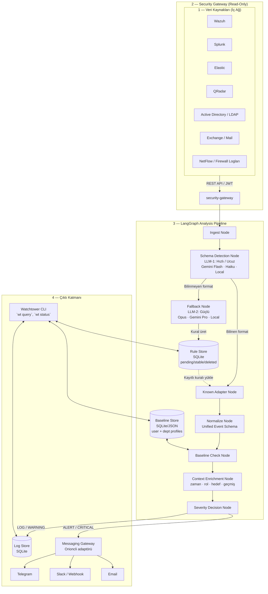

# Watchtower — Master Architecture & Integration Plan

> **Ürün:** LLM-Destekli İç Ağ İzleme CLI'ı (UEBA)
> **Bağımsızlık:** Anthropic dahil herhangi bir sağlayıcıya bağlı değil
> **Tarih:** 22 Mayıs 2026
> **Kaynak:** Ön araştırma konuşmaları ve entegrasyon notları temel alınarak tekil master plan halinde birleştirildi

---

> [!IMPORTANT]
> **Klasör Ayrımı — Karıştırılmamalı**
>
> - **`watchtower-demo/`** = Bizzat inşa ettiğimiz **ürünün kendisi**. LLM destekli, şirket iç ağını izleyen, kullanıcı davranışını analiz eden ve managera uyarı veren CLI sistemi. "Demo" kelimesi ürünün ilk/MVP sürümü olduğunu belirtir.
> - **`server-stack/`** = Bu ürünü test etmek için kurduğumuz **kapalı sunucu ortamı**. Simüle edilmiş şirket ağı: Wazuh, AD, sahte kullanıcılar, üretilmiş loglar. `watchtower-demo` bu ortamı izler.
>
> `server-stack` ← `watchtower-demo` izler

---

## 1. Ürün Kimliği

| Alan | Karar |
|------|-------|
| **Ürün adı** | `watchtower` (alternatif: `vigil`) |
| **Kategori** | UEBA — User and Entity Behavior Analytics |
| **Çalışma ortamı** | Şirket iç ağı (Private LAN / on-premise) |
| **Hedef kitle** | KOBİ + Enterprise, IT Security / CISO |
| **Sentinel ile ilişki** | Ayrı ürün, aynı monorepo ailesi |
| **Çalışma modu** | 7/24 daemon + sorgulama CLI'ı |
| **LLM bağımlılığı** | OpenAI-compatible abstraction (local model desteği dahil) |

---

## 2. Mevcut Repo'dan Yeniden Kullanım Analizi

### 2.1 `sentinel-coming` — CLI & Gateway Temeli

**Neden önemli:** Zaten çalışan bir Python CLI, config katmanlama, read-only gateway pattern ve session/memory altyapısı var.

**Yeniden kullanılacak:**
- Read-only gateway boundary tasarımı
- CLI prompt routing ve config sistemi
- Provider abstraction yaklaşımı
- Safe tool execution modeli

**Kaynak dosya alanları:**
- `sentinel-coming/cli/src/sentinel_cli/config/`
- `sentinel-coming/cli/src/sentinel_cli/tools/`
- `sentinel-coming/cli/src/sentinel_cli/session/`
- `sentinel-coming/observability-gateway/src/observability_gateway/`

**Kullanılmayacak:** Prometheus/Loki/Tempo'ya özgü gateway kontratları.

---

### 2.2 `caglarkc-agent` — Daemon & State Machine Temeli

**Neden önemli:** LangGraph tabanlı state machine + SQLite persistence + checkpoint/recovery + daemon orientation — tam olarak Watchtower'ın ihtiyacı.

**Yeniden kullanılacak:**
- LangGraph graph/state pattern
- SQLite + checkpoint lifecycle
- Event bus ve scheduler modeli
- Long-running daemon/service yapısı
- Memory consolidation ve approval pattern

**Kaynak dosya alanları:**
- `caglarkc-agent/src/core/`
- `caglarkc-agent/src/graph/`
- `caglarkc-agent/src/storage/`
- `caglarkc-agent/src/interfaces/cli/`
- `caglarkc-agent/src/interfaces/telegram/`

**Kullanılmayacak:** Software-project generation semantics, coding workflow'a özgü worker/reviewer logic.

---

### 2.3 `argus` — Permission & Tool Runtime

**Neden önemli:** Temiz modüler runtime — permission levels, hook sistemi, tool registry, multi-provider model erişimi.

**Yeniden kullanılacak:**
- Permission tier tasarımı (`locked` / `yolo` / `planning`)
- Hook modeli (pre-run / post-run)
- Tool registry sınırları
- Trajectory recording (LLM kararlarının audit trail'i)

**Kaynak dosya alanları:**
- `argus/argus/tools/`
- `argus/argus/hooks/`
- `argus/argus/config/`
- `argus/argus/agents/`

---

### 2.4 `nookspace` — Desktop UI (Faz 3+)

**Şimdi değil.** CLI + daemon stabil olduktan sonra operator console için referans.

**Kullanım zamanı:** Faz 3 veya Faz 4 — rule approval UI, session visibility, connector management.

---

### 2.5 Sadece Pattern Referansı

- `estate-agent`: approval-gated tool pipeline örneği
- `orioncli`: messaging gateway adaptörleri (Telegram, Slack, Email)

---

## 3. Sistem Mimarisi

> Bu diyagram **hedef mimariyi** gösterir. İlk implementasyon kapsamı bunun daraltılmış alt kümesidir: `Wazuh-only`, `CLI + Telegram`, `local-model zorunlu`, mail kaynakları ise Faz 2'de devreye alınır.



---

## 4. LangGraph Pipeline — Node Sözleşmeleri

### Node 1: Ingest
- SIEM REST API'lerini polling veya webhook ile dinler
- Ham log batch'lerini çeker, `raw_event` entity'sine yazar
- Rate limit ve retry logic içerir

### Node 2: Schema Detection
- **Birincil yol (deterministik):** Rule Store'daki `stable` format imzalarıyla eşleştir. Eşleşme bulunursa LLM çağrısı yapılmaz.
- **İkincil yol (LLM fallback):** Eşleşme bulunamazsa hızlı/ucuz model devreye girer — Gemini Flash, Haiku veya local quantized model.
- **Görev:** "Bu Wazuh mu, Splunk mu, bilinmeyen bir şey mi?" — sınıflandırma odaklı.
- **Çıktı:** `known_schema` veya `unknown_schema` + güven skoru.
- **Kural:** Faz 1'de kaynak Wazuh-only olduğu için Wazuh format imzası her zaman `stable`'da tanımlı olacak; LLM bu fazda schema detection için çağrılmaz.

### Node 3a: Known Adapter
- Rule Store'daki kayıtlı `stable` kuralları yükler
- Ham event'i unified schema'ya normalize eder
- `normalized_event` entity'si üretir

### Node 3b: Fallback (LLM #2)
- **Model:** Güçlü reasoning — Opus, Gemini Pro, veya local Llama 3.1 70B+
- **Görev:** Bilinmeyen formatı analiz et, field mapping yaz, kural üret
- **Çıktı:** Rule Store'a `pending` statüsünde kural yazar
- **Otonom:** Bir sonraki aynı formatta otomatik devreye girer
- **Yönetici:** İsterse `stable` onayla / sil / düzenle

### Node 4: Baseline Check
- `user_profile` ve `department_profile` ile karşılaştırır.
- **Faz 1 (Learning):** Sadece veri biriktirir, baseline anomaly üretmez. **Ancak:** `hard-rule` sınıfındaki tespitler (bkz. Bölüm 4a) her fazda ateşlenir — bunlar baseline beklemez.
- **Faz 2 (Active):** Sapma skoru hesaplar, `baseline anomaly` ve `cross-signal correlation` aktif hale gelir.

### Node 4a: Detection Taxonomy (Kalıcı Karar)

Her detection üç sınıftan birine aittir ve bu sınıf Faz 1'de bile ateşlenip ateşlenmeyeceğini belirler:

| Sınıf | Açıklama | Faz 1'de ateşlenir mi? | Örnekler |
|-------|----------|----------------------|----------|
| `hard-rule` | Policy ihlali; baseline verileri olmadan da anlam taşır | **Evet, her zaman** | Servis hesabı interaktif login (F-009), privileged grup değişikliği (F-010), promiscuous mod (F-035) |
| `baseline-anomaly` | Kullanıcının kendi normalinden sapma | Hayır, Faz 2'den itibaren | Veri çekim patlaması (F-001), mesai dışı login (F-007) |
| `cross-signal` | İki veya daha fazla kaynaktan gelen verinin korelasyonu | Hayır, Faz 2'den itibaren | Fiziksel-dijital çakışma (F-008), ticket olmadan reset (F-013) |

`hard-rule` listesi açık olmalı; her yeni feature eklenirken sınıfı belirtilmeli.

### Node 5: Context Enrichment
Sapma puanını etkileyen boyutlar; **deterministik olanlar önce hesaplanır, LLM yalnızca açıklama ve composite reasoning için çağrılır:**

| Boyut | Hesaplama | LLM gerekir mi? |
|-------|-----------|----------------|
| **Miktar** — baseline'dan sapma | Deterministik (z-score veya percentile) | Hayır |
| **Zaman** — mesai / gece / hafta sonu | Deterministik (takvim kuralı) | Hayır |
| **Rol** — IT / muhasebe / HR | Deterministik (AD grup lookup) | Hayır |
| **Hedef** — hangi sunucuya erişiyor | Deterministik (user_profile.usual_servers) | Hayır |
| **Hız** — ani mi kademeli mi | Deterministik (bytes/dk hesabı) | Hayır |
| **Geçmiş** — daha önce böyle yaptı mı | Deterministik (baseline_snapshot sorgusu) | Hayır |
| **Açıklama ve öneri üretimi** | LLM | **Evet** — sadece bu adım |

LLM, alert metnini ve operatöre yönelik öneriyi yazar. Anomali kararı vermez.

### Node 6: Severity Decision
```
Enriched anomaly score → Severity tier

LOG      → sessiz kayıt
WARNING  → anomali skoru yüksek, izle
ALERT    → manager bildirimi
CRITICAL → anlık bildirim + işlem önerisi
```

Eşikler **statik değil** — her kullanıcı/departman için ayrı, learning fazında öğrenilen baseline'a göre dinamik.

---

## 5. İki Fazlı Çalışma Modeli

### Faz 1 — Learning (Varsayılan: 1-2 ay)

**Amaç:** Sessiz izleme, hiç alert üretme, baseline oluştur.

**Her gün:** Günlük özet hesapla → günlük ortalamalara ekle.
**Her hafta:** Haftalık pattern güncelle, sezonsal drift not et.
**Ay sonu:** LLM "dreaming" — tüm biriken veriyi analiz et → kullanıcı ve departman profili oluştur.

**Öğrenilen boyutlar:**
```
Kullanıcı bazında:
  - Günlük ortalama veri çekimi (mean + variance)
  - Saatsel dağılım (09:00-18:00 arası mı hep?)
  - Hangi sunuculara erişiyor (usual_servers listesi)
  - Hafta içi / hafta sonu farkı
  - Rol bağlamı

Departman bazında:
  - Ekip ortalaması
  - Sezonsal değişimler (muhasebe ay sonu 2.3x normal gibi)
  - Rol bazlı beklentiler
```

**Otomatik faz geçiş kriterleri:**
- 30+ gün geçti ✓
- Kullanıcı başına 20+ aktif gün verisi ✓
- Departman başına 15+ kullanıcı verisi ✓
- LLM confidence score > 0.75 ✓
→ Manager onayı ister → Active faza geçer

---

### Faz 2 — Active (Süresiz)

**Öğrenme devam eder.** Rolling window: son 90 günün ağırlıklı ortalaması. Rol değişirse, yeni proje başlarsa sistem adapte olur.

**Alert formatı (CRITICAL örneği):**
```
CRITICAL ALERT — 22 Mayıs 2026, 03:47
Kullanıcı: ali.koc@sirket.com | Departman: Muhasebe
Olay: 847 GB veri çekimi (baseline: 8 GB/gün — 105x sapma)
Kaynak sunucu: HR-DB-01, FINANCE-DB-02
Zaman: Gece 03:00-04:00 (mesai dışı)
Hız: 5 dakikada 200 GB (anormal yüksek hız)

LLM Yorumu: Bu kullanıcının rolü için bu miktarda veri çekimi
olağandışıdır. Gece saatinde gerçekleşmesi ve iki farklı kritik
sunucuya erişim riski artırıyor. Departman normunun 105 katı.

Öneri: Oturumu inceleyin, gerekirse IT güvenlik birimini bilgilendirin.
```

---

## 6. Veri Modeli (Domain Entities)

| Entity | Açıklama |
|--------|----------|
| `source` | SIEM bağlantısı (Wazuh, Splunk vb.) |
| `raw_event` | Ham log, parse edilmemiş |
| `normalized_event` | Unified schema'ya çevrilmiş event |
| `user_profile` | Bireysel baseline profili |
| `department_profile` | Departman bazlı normlar |
| `baseline_snapshot` | Aylık öğrenme özeti |
| `anomaly_assessment` | Enriched skoru ve bağlam bilgisi |
| `rule_candidate` | Fallback LLM'in ürettiği pending kural |
| `rule_version` | Onaylı / güncellenmiş kural versiyonu |
| `alert` | Üretilen uyarı kaydı |
| `alert_ack` | Manager onayı / reddi |
| `learning_window` | Faz 1 progress takibi |

---

## 7. Rule Store Şeması

```json
{
  "id": "rule_auto_20260522_001",
  "source": "fallback_llm",
  "status": "pending",
  "format_signature": "vendor_x_firewall_v2",
  "field_mapping": {
    "src_addr": "source_ip",
    "dst_bytes": "data_volume_bytes",
    "usr_id": "user_id"
  },
  "confidence": 0.87,
  "created_at": "2026-05-22T03:47:00Z",
  "used_count": 3,
  "last_used": "2026-05-22T08:12:00Z",
  "promoted_to_stable_at": null
}
```

`used_count >= 10` → `stable` promote adayı olur, manager'a bildirim gider.

---

## 8. Uygulama Fazları

### Faz 0 — Sabit Mimari Kararlar

| Karar | Önerilen |
|-------|----------|
| Repo konumu | Yeni root klasör: `watchtower/` (`sentinel-coming` dışında) |
| Storage (Faz 1) | SQLite (aiosqlite), Postgres opsiyonel sonra |
| İlk SIEM hedefi | Wazuh (ücretsiz, en geniş deployment) |
| İlk alert kanalı | CLI + Telegram (önce), Email / webhook sonra |
| LLM provider stratejisi | OpenAI-compatible abstraction — local model path zorunlu |
| Gateway / analyzer ilişkisi | Ayrı servis boundary: `security-gateway` ayrı, `analysis-daemon` ayrı |
| Faz 1 kapsamı | Login + file + network + AD davranışı; mail kaynakları Faz 2'de |

---

### Faz 1 — Temel Altyapı

- [ ] `watchtower/` package oluştur (monorepo root altında)
- [ ] Python venv + dependencies: `langgraph`, `aiosqlite`, `httpx`, `typer`
- [ ] SQLite şemaları: Rule Store, Baseline Store, Log Store
- [ ] `security-gateway` servis iskeletini kur (sentinel-coming gateway'den pattern al)
- [ ] Config katmanlama sistemi (sentinel-coming'den pattern al)
- [ ] Wazuh-only ingest path ile ilk demo akışını ayağa kaldır

---

### Faz 2 — Ingestion & LLM Katmanları

- [ ] Wazuh REST API adaptörü (JWT auth, alert polling)
- [ ] LangGraph workflow iskeletini kur (caglarkc-agent'tan pattern al)
- [ ] LLM #1 prompt: schema classification (Wazuh / Splunk / Elastic / Unknown)
- [ ] LLM #2 prompt: fallback rule generation + field mapping
- [ ] Known Adapter: Wazuh → normalized_event
- [ ] Rule Store CRUD + pending/stable/deleted lifecycle

---

### Faz 3 — Baseline & Learning Engine

- [ ] Learning daemon: günlük cron aggregation
- [ ] Haftalık pattern güncelleme
- [ ] Ay sonu LLM "dreaming" — toplu baseline üretimi
- [ ] Faz geçiş kriterleri kontrolü + manager onay akışı
- [ ] Baseline Store CRUD (user_profile + department_profile)

---

### Faz 4 — Anomali Tespiti & Alert

- [ ] Context Enrichment node (zaman, rol, hedef, hız, geçmiş)
- [ ] Severity decision logic (dinamik eşikler, rolling window)
- [ ] Alert üretimi + deduplication + suppression
- [ ] caglarkc-agent'ın approval pattern'i ile manager onay akışı

---

### Faz 5 — CLI & Notification Gateway

- [ ] `wt` CLI: `status`, `query`, `alerts`, `rules`, `baseline`
- [ ] Telegram adapter (orioncli'dan pattern al)
- [ ] Email / webhook adapter
- [ ] Splunk + Elastic adaptörleri (Wazuh'tan sonra)
- [ ] (Opsiyonel) nookspace tabanlı operator console

---

## 9. CLI Sorgu Arayüzü

```bash
# Sistem durumu
wt status

# Son 24 saatteki uyarılar
wt query "son 24 saatteki uyarılar"
wt alerts --last 24h --severity warning,alert,critical

# Kullanıcı baseline görüntüle
wt baseline user ali.koc@sirket.com

# Tanınmayan format eventleri
wt query "tanınmayan schema eventleri"
wt rules list --status pending

# Kural yönetimi
wt rules approve <rule_id>
wt rules delete <rule_id>

# Faz durumu
wt learning status
```

---

## 10. Risk Analizi

### Ürün Riskleri

| Risk | Etki | Önlem |
|------|------|-------|
| KVKK/GDPR uyumu | Yüksek | Read-only, analiz sadece iç ağda, veri dışarı çıkmaz |
| False positive | Orta | Learning fazı zorunlu, dinamik eşikler |
| Müşteri bazlı baseline drift | Orta | Rolling window, otomatik adaptasyon |
| LLM overuse | Düşük | LLM sadece anomali skoru yüksek event'lerde çalışır |

### Teknik Riskler

| Risk | Etki | Önlem |
|------|------|-------|
| Schema sprawl (SIEM + custom log) | Yüksek | Fallback LLM + Rule Store öğrenme mekanizması |
| Kapalı ağda model erişimi | Yüksek | OpenAI-compatible local model zorunlu path |
| Ham event storage büyümesi | Orta | Raw event TTL, sadece normalized + alert'i sakla |
| Alert fatigue | Orta | Deduplication, suppression window, tier sistemi |

### Repo Riski

Monorepo'da birden fazla overlapping agent runtime var. `caglarkc-agent`, `argus`, `sentinel-coming` hepsinden **pattern al, copy-paste yapma.** Watchtower kendi consistent runtime'ını kuracak, tüm projelerin mix'i olmayacak.

---

## 11. Kesin Sınırlar

**Şimdi yapılacak:**
- Dedicated security gateway
- Dedicated analysis daemon (LangGraph)
- Dedicated CLI package
- Dedicated SQLite storage schema

**Sadece pattern referansı:**
- sentinel-coming → CLI runtime fikirleri
- caglarkc-agent → LangGraph orchestration fikirleri
- argus → permission ve tool fikirleri
- nookspace → ileride desktop shell

**Faz 1'de yapılmayacak:**
- Full desktop app
- Plugin marketplace
- Aynı anda birden fazla SIEM
- Auto-remediation (sadece öneri)
- İnfra observability ile employee behavior'un aynı schema'ya karıştırılması

---

## 12. Final Karar Özeti

Bu belgeye göre başlangıç konfigürasyonu artık nettir:

1. **Ürün konumu:** `watchtower/` root altında, Sentinel'den ayrı ama aynı workspace ailesinde
2. **İlk SIEM:** `Wazuh-only`
3. **İlk bildirim kanalı:** `CLI + Telegram`
4. **Model stratejisi:** OpenAI-compatible abstraction, fakat kapalı ağ senaryosu için `local model path` zorunlu
5. **Faz 1 kapsamı:** `login + file + network + AD`
6. **Mail izleme:** Faz 2'de devreye alınır
7. **Auto-remediation:** Yok; sadece öneri ve alert üretimi

---

*Plan oluşturulma tarihi: 22 Mayıs 2026*
*Kaynak: Ön araştırma konuşmaları ve entegrasyon notlarının konsolide özeti*
